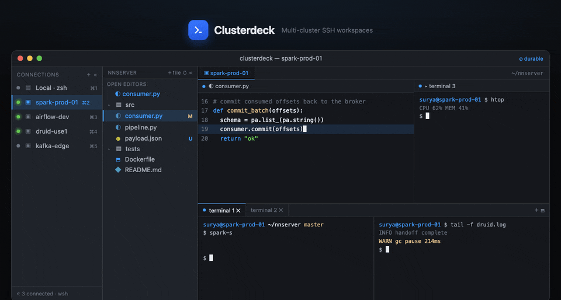
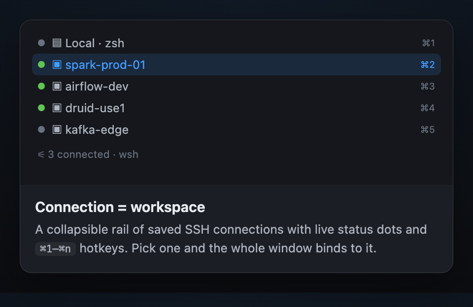
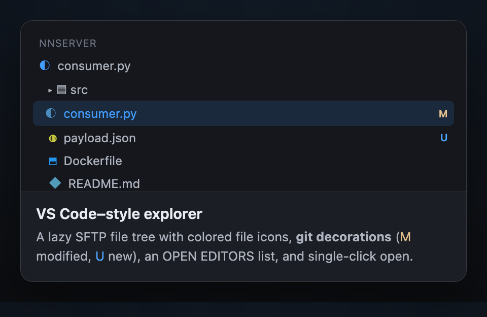
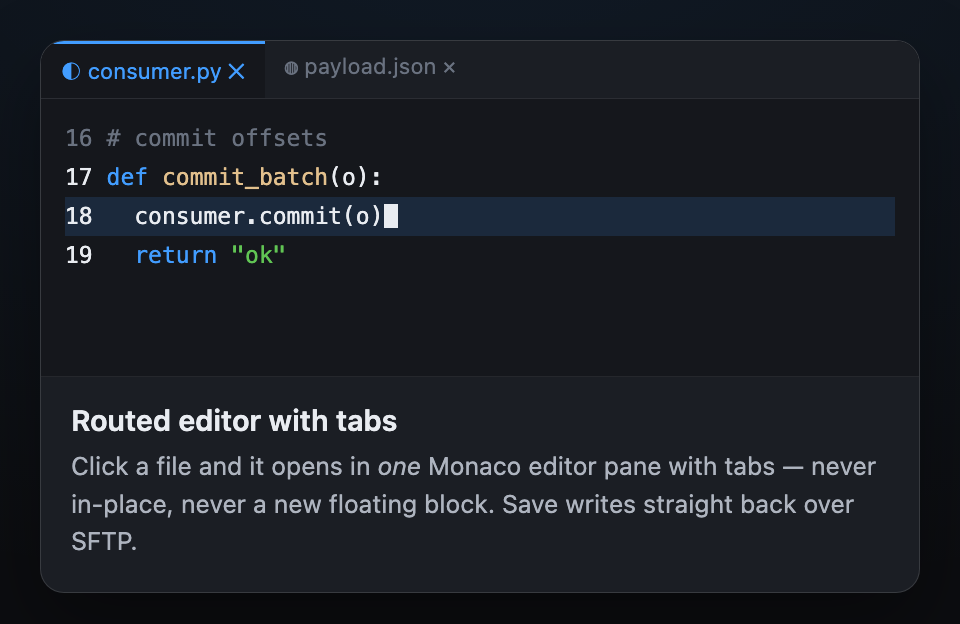
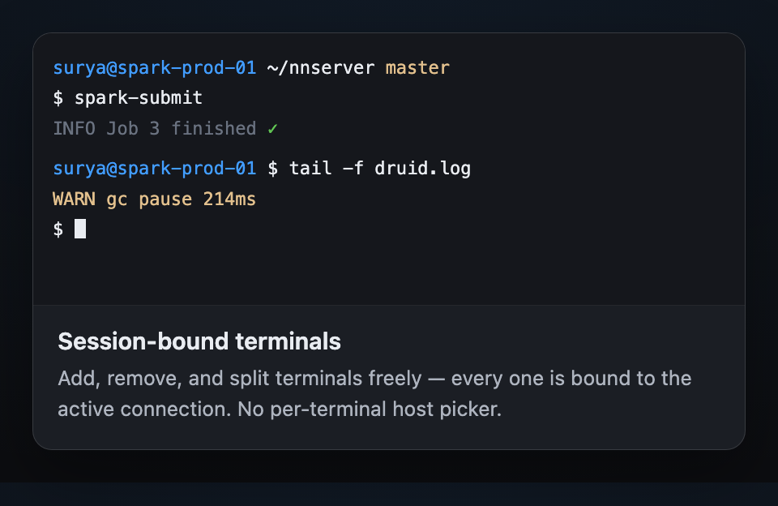
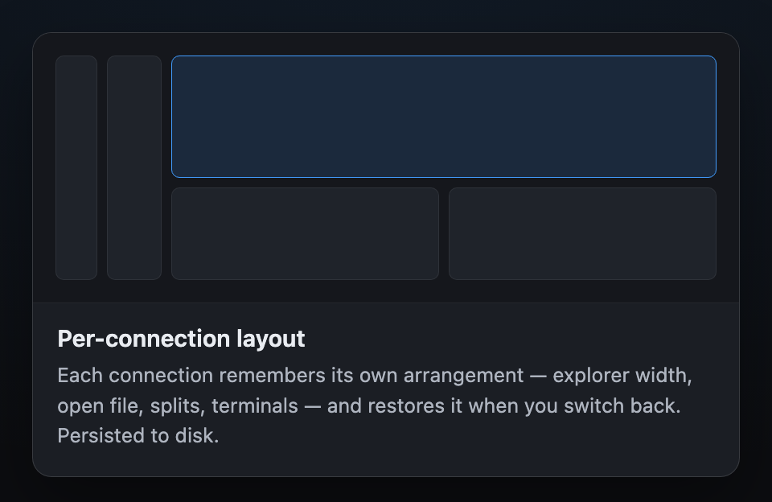
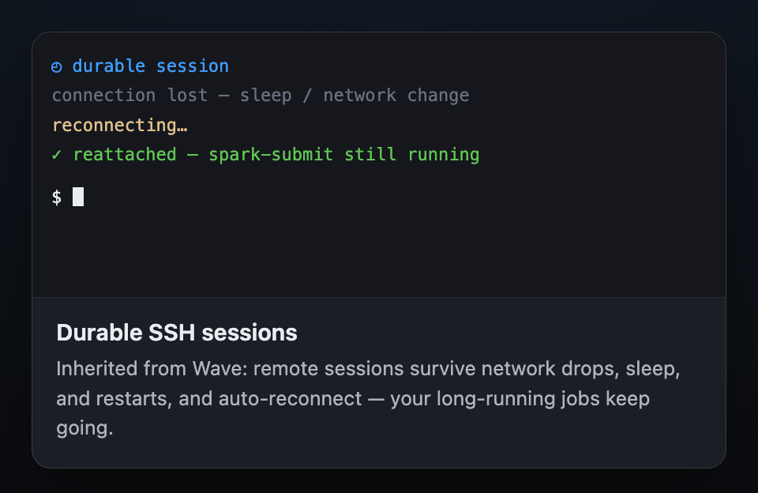

<p align="center"><b>⬇ This repo hosts Clusterdeck's built binaries and releases.</b><br/>
Source code lives in <a href="https://github.com/clusterdeck/app">clusterdeck/app</a> (private) — nothing below is duplicated code, just the README so this page explains the project too.</p>

---

# Clusterdeck

A VS Code–style, multi-cluster SSH workspace. **The connection *is* the workspace** —
selecting an SSH connection in the left rail sets the context for the entire window
(the file explorer, the editor, and every terminal), and each connection remembers its
own layout. Switching clusters is a click, not a new window.

Clusterdeck is a fork of [Wave Terminal](https://www.waveterm.dev) reshaped from a
free-floating block terminal into a fixed IDE layout for working across many clusters
in a single window. macOS-first.



> The three vertical zones — **connections rail**, **file explorer**, and **editor +
> terminals** — all bound to the active SSH connection.
> ([static image](images/clusterdeck-ui.png))

## Features

|  |  |
|:--|:--|
|  |  |
|  |  |
|  |  |

- **Shell connections rail** — a vertical, collapsible workspace switcher with status
  dots and `⌘1–⌘n` hotkeys; each connection is a saved workspace.
- **Connection = workspace** — new terminals, the editor, and the explorer all bind to
  the active connection; no per-block connection picker.
- **Full-height file explorer** — a VS Code–style tree over SFTP with an open-editors
  list, git decorations, and single-click open.
- **Routed editor** — clicking a file opens it in one designated Monaco editor pane
  (with editor tabs), never in-place or as a new floating block.
- **Per-connection layout** — the explorer/editor/terminal arrangement persists per
  connection and restores when you switch back.

It keeps Wave's durable SSH sessions, `wsh` command system, connection controller,
Monaco editor, terminal blocks, secret storage, and themes intact.

## Install

macOS-first (Apple Silicon). Easiest — via Homebrew:

```sh
brew tap clusterdeck/tap
brew install --appdir=~/Applications --cask clusterdeck   # no admin/sudo needed
```

(Drop `--appdir=~/Applications` to install into `/Applications` if you have admin rights.
The app isn't code-signed yet, so Gatekeeper will block the first launch — see the cask's
install caveats for the one-line fix, or run:
`xattr -dr com.apple.quarantine ~/Applications/Clusterdeck.app`.)

Or grab the `.dmg` directly from this repo's [Releases](../../releases) page, open it,
and drag **Clusterdeck** into Applications.

Upgrade later with `brew upgrade --cask clusterdeck`; uninstall with
`brew uninstall --cask clusterdeck`.

## Built on Wave Terminal

Clusterdeck is a derivative work of **[Wave Terminal](https://github.com/wavetermdev/waveterm)**
by Command Line Inc., and would not exist without it. Wave is a fantastic open-source
terminal — please check it out, and consider
[sponsoring the upstream project](https://github.com/sponsors/wavetermdev).

- **Upstream:** https://github.com/wavetermdev/waveterm
- **License:** Apache License 2.0 — Wave's original [`LICENSE`](./LICENSE) and
  [`NOTICE`](./NOTICE) are preserved unmodified in this repo too.
- **What changed:** every substantive modification from upstream Wave is recorded in
  `CHANGES.md` in the source repo, per Apache-2.0 §4(b).

Clusterdeck is an independent project. It is **not affiliated with, sponsored by, or
endorsed by Command Line Inc.** "Wave" and "Wave Terminal" are names of the upstream
project and are used here only to credit and identify it.

## License

Clusterdeck is distributed under the **Apache License 2.0** — the same license as Wave
Terminal. See [`LICENSE`](./LICENSE) for the full text and [`NOTICE`](./NOTICE) for
attribution. Apache-2.0 permits private and commercial use; this fork keeps the upstream
attribution the license requires, which is what makes commercializing it safe.
